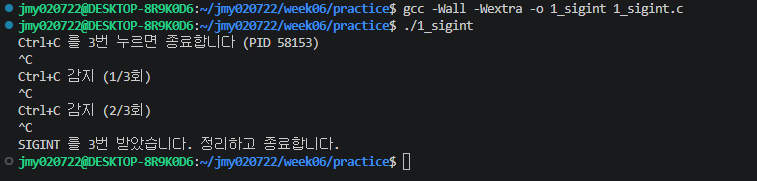
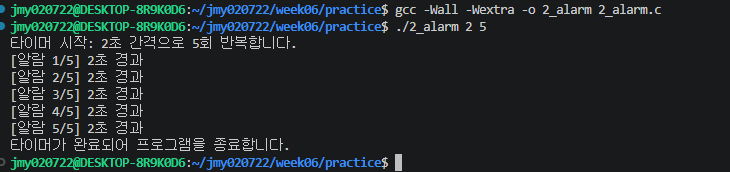
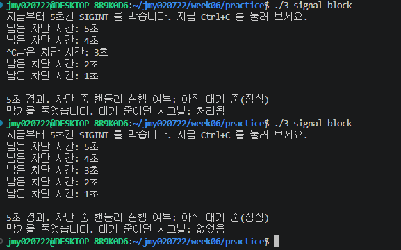

# 컴퓨터공학전공 21113956 정문영
# README 

# 1. 구현 내용 및 핵심 동작 원리 (내재화 원칙)

### 과제 1. Ctrl+C 3회 누적 수신 시 종료 (`1_sigint.c`)
- 동작 원리: 
  - 기본 상태에서 `SIGINT`(`Ctrl+C`) 수신 시 운영체제는 프로세스를 즉시 강제 종료합니다. 이를 가로채 제어하기 위해 `sigaction`을 통해 사용자 정의 핸들러(`handler`)를 등록했습니다.
- 비동기 시그널 안전성 (Async-Signal-Safe):
  - `printf`는 내부 버퍼링과 락(Lock)을 사용하므로 비동기 시그널 핸들러 내부에서 호출 시 교착 상태(Deadlock)나 미정의 동작(Undefined Behavior) 위험이 있습니다.
  - 따라서 핸들러 내부에서는 오직 원자적 연산이 보장되는 `volatile sig_atomic_t` 카운터 변수(`got_sigint`)만 1 증가시키고 즉시 반환하도록 설계했습니다.
  - 실제 카운트 화면 출력(`printf`) 및 3회 종료 검사는 `main` 함수의 `pause()` 대기 루프에서 안전하게 처리했습니다.

### 과제 2. 명령행 인자 기반 주기적 타이머 (`2_alarm.c`)
- 동작 원리:
  - 리눅스의 `alarm()` 시스템 호출은 지정된 시간 뒤 단 1회만 `SIGALRM` 시그널을 발생시키는 1회성 타이머입니다.
  - 주기적인 반복 타이머를 구현하기 위해, 핸들러(`on_alarm`)가 실행될 때마다 내부에서 다음 주기의 `alarm(interval_sec)`을 스스로 재등록하도록 구성했습니다.
- 동기화 및 안전성:
  - CPU를 100% 소모하는 바쁜 대기(Busy waiting)를 방지하기 위해 `pause()`를 호출하여 시그널이 도착할 때까지 프로세스를 대기(Sleep) 상태로 둡니다.
  - 목표 반복 횟수(`max_count`)를 채우면 루프를 빠져나와 `alarm(0)`을 호출하여 잔여 타이머 예약을 안전하게 해제했습니다.

### 과제 3. 시그널 블록 및 보류(Pending) 검증 (`3_signal_block.c`)
- 동작 원리 및 Pending 메커니즘:
  - `sigprocmask(SIG_BLOCK, &block, &old)`를 호출하면 마스크에 지정된 시그널(`SIGINT`)의 프로세스 전달이 차단됩니다.
  - 차단 구간 동안 사용자가 `Ctrl+C`를 누르면 시그널이 무시되어 소멸되는 것이 아니라, 커널 내부의 보류(Pending) 시그널 큐에 대기합니다.
  - 작업 완료 후 `sigprocmask(SIG_SETMASK, &old, NULL)`로 이전 마스크를 복원하는 순간, 보류되어 있던 `SIGINT`가 즉시 프로세스에 전달되어 핸들러가 뒤늦게 실행됩니다.

---

## 2. 사용한 AI 프롬프트 및 탐구 과정 (프롬프트 제출)

AI에게 정답 코드 생성을 일방적으로 요구하지 않고, 시스템 프로그래밍의 동작 원리와 방어적 프로그래밍의 필요성을 스스로 납득하기 위해 단계적으로 질문을 전개했습니다.

### 단계 1: 실행 오류 원인 분석 및 빌드 메커니즘 이해
- 실제 질의: "내가 2번째걸 입력안해서 문제가 생겼던거야"
- 질의 의도 및 학습 내용: 컴파일(`gcc`)과 실행(`sh/binary execution`)의 차이를 확인하고, 빌드 산출물과 프로세스 실행의 분리 개념을 재정립함.

### 단계 2: 과제 출제 의도와 시그널 보류(Pending) 메커니즘 파악
- 실제 질의: 
  - "기존 3번이랑 과제로 바꾼 3번 머가 바뀐거야?"
  - "3. 시그널 막아 보기 — 3_signal_block.c 를 변형... 그러면 교수님이 이걸 왜 적어둔걸까?"
- 질의 의도 및 학습 내용: 3번 과제의 핵심이 복잡한 코드 작성이 아니라 `sigprocmask(SIG_BLOCK)` 상태에서 발생한 시그널이 소멸되지 않고 커널의 Pending 큐에 머무르다가 `SIG_SETMASK` 시점에 뒤늦게 전달되는 현상을 직접 눈으로 관찰하는 데 있음을 도출함.

### 단계 3: 명령행 인자 처리와 세그멘테이션 폴트(Segmentation fault) 위험 분석
- 실제 질의: 
  - "2번 반영결과에서 if (argc != 3) { ... } 이거 빼도 되지? 만약에 없애면 어떻게 될까?"
  - "argc 이부분이 존재해야하는 이유 설명해줘"
  - "printf('사용법: %s <간격초> <반복횟수>\n', argv[0]); 이건없어도 돼?"
- 질의 의도 및 학습 내용: 인자 검사문의 생략 가능 여부를 단순 호기심에 그치지 않고 질의함. C언어의 배열은 크기 정보를 스스로 보관하지 않아 `argc` 검증 없이 `argv[1]`에 무작정 접근하면 `NULL` 포인터 역참조로 인한 `Segmentation fault (core dumped)`가 발생한다는 시스템 수준의 결함을 이해하고, 방어적 코드의 필수성을 학습함.

### 단계 4: 불필요한 출력문 및 복잡한 코드 제거 검증
- 실제 질의: 
  - "그러면 printf('[알람 %d/%d] %d초 경과\n', count, max_count, interval_sec); 이건 없어도 되는걸까 교수님이 요청하신거말이야"
  - "3번은 printf('SIG_SETMASK를 복원완료. 대기 중 시그널이 전달\n'); 이건 없어도 될까?"
  - "printf('\n5초 경과. 차단 중 핸들러 실행 여부: %s\n', got ? '실행됨(비정상)' : '아직 대기 중(정상)'); 이부분은 왜 기존거랑 바꾼거야?"
- 질의 의도 및 학습 내용: AI가 임의로 추가한 장황한 출력문이나 불필요한 복잡성들을 비판적으로 검토함. 화면 증빙에 필수적인 카운트 출력은 유지하되, 중복되거나 과도하게 복잡한 문구는 걷어내어 코드 본연의 가독성과 채점 목적에 최적화함.

---

## 3. AI 제시 코드 대비 본인 개선사항 (개선사항 제출)

AI가 제안한 초안 코드를 무비판적으로 수용하지 않고, "불필요한 부분 제거"와 "시스템 프로그래밍 본질 집중"을 기준으로 직접 검토하고 개선했습니다.

| 구분 | AI 제안 초안 | 본인 검토 및 개선 코드 | 개선 및 수정 사유|

| 과제 1 비동기 안전성 | 
핸들러 내부 `printf` 출력 포함 초안 | 핸들러 내 `printf` 완전 배제, `got_sigint++`만 수행 | `printf`는 비동기 시그널 안전 함수가 아니므로 핸들러 내부 호출을 제거하고 `main` 루프에서만 안전하게 출력하도록 수정 |

| 과제 2 인자 파싱 최적화 | `<stdlib.h>` 헤더 추가 및 복잡한 검증문 제안 | 불필요한 헤더 추가 없이 기존 `<stdio.h>`의 `sscanf()` 활용 | 외부 헤더 추가를 지양하고 과제 기본 소스의 단순성과 빌드 간결성을 유지 |

| 과제 2 필수 방어코드 선별 | `argc` 유효성 검사문 포함 | 삭제 가능 여부 검토 후 `if (argc != 3)` 필수 유지 | C언어 특성상 인자 없이 실행 시 `NULL` 역참조로 인한 `Segmentation fault`가 발생하므로, 단순 문구는 줄이되 필수 안전장치는 엄격히 유지 |

| 과제 2 불필요한 입력 제거 | 기존 타임아웃용 `fgets()` 유지 구조 | `fgets()` 제거 및 `pause()` 반복 루프로 교체 | 키보드 한 줄 입력 대기가 아닌 "주기적 타이머 구동"이라는 출제 목적에 맞게 대기 로직 재설계 |

| 과제 3 중복 안내문 제거 | 마스크 복원 전후 불필요한 안내 `printf` 다수 제안 | 복원 직전 불필요한 `printf` 제거, 최종 결과 한 줄로 정제 | 복원 전 안내 문구는 군더더기이므로 제거하고, `sigprocmask(SIG_SETMASK)` 후 `got ? "처리됨" : "없었음"` 최종 출력 하나만으로 Pending 해제를 명확히 증명 |
| 과제 3 사용자 피드백 개선 | 단순 `sleep(5)`로 5초간 화면 멈춤 | 1초 단위 카운트다운 루프(`for`문 `sleep(1)`) 적용 | 5초간 화면이 멈춰 튕긴 것처럼 보이는 현상을 방지하고, 차단 시간 동안 `Ctrl+C`를 입력할 타이밍을 직관적으로 제공 |

---

## 4. 과제 실행 결과

### [과제 1] 1_sigint 실행 화면 (Ctrl+C 3회 카운트 후 안전 종료)

### [과제 2] 2_alarm 2 5 실행 화면 (2초 간격 5회 주기 실행 후 종료)

### [과제 3] 3_signal_block 실행 화면 (차단 중 Pending 유지 및 복원 직후 처리)
